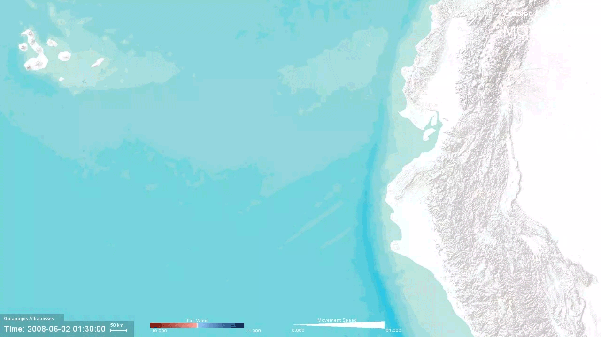
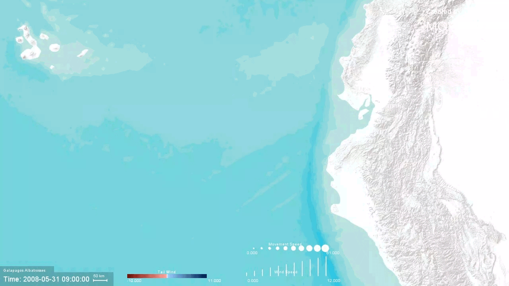
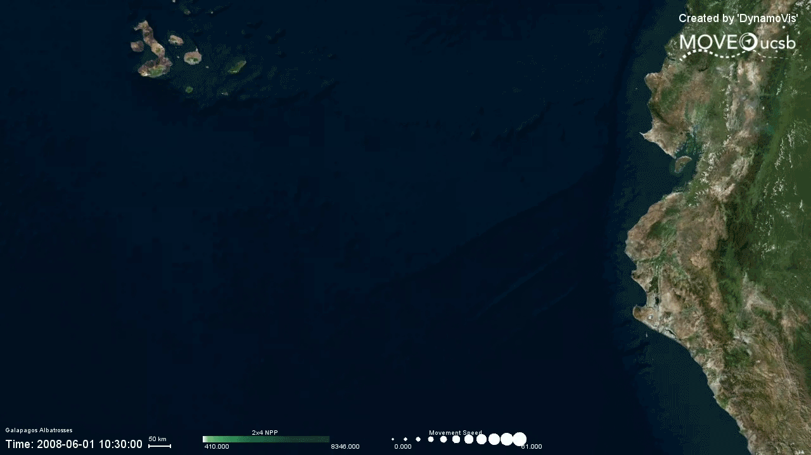

# DynamoVis

<!--  -->
<span class="img_container center" style="display: block;">
    </br>
<!--     <span class="img_caption" style="color:gray; display: block; text-align: left;">A collage of seven visualizations of turkey vulture Sarkis with various types and representations. Software icon for macOS is on the upper-right. </span> -->
<br>
</span>

<blockquote cite="https://www.huxley.net/bnw/four.html">
   <p>Dodge, S., Toka, M. & Bae, C.J. DynamoVis 1.0: an exploratory data visualization software for mapping movement in relation to internal and external factors. Mov Ecol 9, 55 (2021). https://doi.org/10.1186/s40462-021-00291-5</p>
</blockquote>

**DynamoVis** is a data visualization software specifically targeted for spatiotemporal movement data. It is developed by [Move Lab @ UC Santa Barbara](https://move.geog.ucsb.edu/) and designed to be accessible and easily usable for scientists without extensive prior experience with programming, GIS software, or custom data visualization tools. The intuitive design focuses on a simple interface for scientists to apply spatial data visualization techniques, giving ecologists and biologists of all backgrounds the power to visualize complicated spatial patterns.

<figure>
     <span class="img_container center" style="display: block;">
         </br>
     <!--     <span class="img_caption" style="color: gray; display: block; text-align: left;"></span> -->
     </span>
     <figcaption>- <i>An animation of the user interface using Galapagos Albatross movement data with various basemaps and visualization parameters.</i></figcaption>
</figure>

## Usage
Download the latest release [here](https://github.com/move-ucsb/DynamoVis/releases). 

Zip file contains automated scripts to run the software on Windows (`run_windows.bat`) and Unix-based systems (`run_unix.sh`). Make sure to have Java 15 installed and set up in your system or user PATH. 

You can also run the jar file using below command in extracted folder:
 
```shell
 java -jar DynamoVis-1.0.jar
```

- Scroll down to 'Compile from source' section for notes on compiling the software from the source code. 

## Use cases
### Turkey vulture [data set](https://doi.org/10.5441/001/1.46ft1k05)
<span class="img_container center" style="display: block;">
    </br>
    <span class="img_caption" style="color:gray; display: block; text-align: center;">- <i>An exported animation of the turkey vulture Leo on Microsoft Aerial basemap. It shows the foraging behavior of Leo -- moving slowly or pausing in high-vegetation areas (NDVI), shown with bright green circles.</i></span>
</span>
<br></br> 
<span class="img_container center" style="display: block;">
    </br>
    <span class="img_caption" style="color:gray; display: block; text-align: center;">- <i>Another exported track animation of turkey vulture Leo displayed on Esri World Terrain basemap. The thicker purple line visualizes thermal uplift that aids the bird to move faster. The thin underlay lines shows the prior movement of Leo, hinting its commonly-travelled routes</i></span>
</span>

<br></br> 

### Galapagos albatrosses [data set](https://doi.org/10.5441/001/1.3hp3s250) 
<span class="img_container center" style="display: block;">
    <div style="display: block;">
        <div style="float: left; width: 49%; padding-right: 5px;">
            
        </div>
        <div style="float: left; width: 49%;">
            
        </div>
    </div>
    </br>
    <span class="img_caption" style="color:gray; display: block; text-align: center;">- <i>An set of exported animations of one Galapagos albatross track (4264-84830852) displayed on Esri World Terrain basemap, illustrating the relationship between the movement speed and wind support. The left visualization highlights the use of higher tail-wind support (shown in blue color) for faster outbound flights (shown with thicker lines), and the right map shows the actual wind direction using vectors of variable size.</i></span>
</span>
<br></br> 
<span class="img_container center" style="display: block;">
    
    <span class="img_caption" style="color:gray; display: block; text-align: center;">- <i>Another animation of the albatross (4264-84830852) displayed on the Microsoft Aerial basemap. The visualization highlights the relationship between net primary production (NPP) of the ocean and albatross movement speed. The albatross appears to move slowly (smaller point size) or make frequent stops along the coast of Peru to forage in high NPP areas (shown in darker green colors). The bird appears to fly faster (larger point size) during the flights over the ocean and around the Galapagos where ocean NPP is lower (lighter green colors).</i>
    </span>
</span>

## Config
`./config/` directory stores extra files that are useful for the use case of the software. 

- `RememberedHeaders.txt` stores the names of the required fields for DynamoVis to function properly. Upon loading data to the software, the header names of the *unique identifier, latitiude, longitude* and *timestamp* will be recorded in this file for future reference. Successive loading of the same file will use information recorded in this file. 

- `EnvDATA-variables.csv` keeps the details of known fields, commonly used by [EnvData system](https://www.movebank.org/cms/movebank-content/env-data). 

- `DiscardedFields.txt` hold a list of columns (or fields) in the data that is discarded by DynamoVis. Feel free to add more fields in your local copy to prevent loading unnecessary fields to your animations. 

- `./color/` and `./legend/` folders keeps a copy of the custom color ramps and legend layouts.

## Data
We distribute copies of Galapagos Albatrosses and Turkey Vultures data sets along with the repository in `./public-data` directory.

## Compile from source
If you'd like to clone the repository and compile from the source, make sure to have [Git Large File System](https://git-lfs.github.com/) installed and enabled. Git-LFS is required for large `*.csv` files. If you don't want to install Git-LFS, you will need to clone the repository and manually download .csv files in `/config` and `/public-data`.

## Contact
Feel free to open an [issue](https://github.com/move-ucsb/DynamoVis/issues) in case something is wrong.

#### Tested on:
- Windows 10
- macOS Catalina - 10.15
- Java 15.0.2
