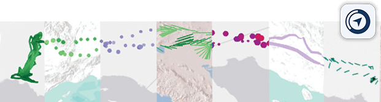

# DynamoVis

<!--  -->
<span class="img_container center" style="display: block;">
    </br>
<!--     <span class="img_caption" style="color:gray; display: block; text-align: left;">A collage of seven visualizations of turkey vulture Sarkis with various types and representations. Software icon for macOS is on the upper-right. </span> -->
<br>
</span>

**DynamoVis** is a data visualization software spesifically targeted for spatiotemporal movement data. It is developed by [Move Lab @ UC Santa Barbara](https://move.geog.ucsb.edu/) and designed to be accessible and easily usable for scientists without extensive prior experience with programming, GIS software, or custom data visualization tools. The intuitive design focuses on a simple interface for scientists to apply spatial data visualization techniques, giving ecologists and biologists of all backgrounds the power to visualize complicated spatial patterns.

<!--  -->

<span class="img_container center" style="display: block;">
    </br>
    <span class="img_caption" style="color: gray; display: block; text-align: left;">An animation of the user interface using Galapagos Albatross movement data with various basemaps and visualization parameters.</span>
</span>
<br></br> 
<span class="img_container center" style="display: block;">
    </br>
    <span class="img_caption" style="color:gray; display: block; text-align: center;">An exported animation of the turkey vulture <i>Leo</i> on Microsoft Aerial basemap. Leo appears to move slowly or pause in high-NDVI areas, shown with bright green circles. The bird's movement speed is also aided by thermal uplift.</span>
</span>
<br></br> 
<span class="img_container center" style="display: block;">
    </br>
    <span class="img_caption" style="color:gray; display: block; text-align: center;">Another exported track animation of turkey vulture <i>Leo</i> displayed on Esri World Terrain basemap. The thicker red line visualizes thermal uplift that aids the bird to move faster. The thin lines shows the prior movement of Leo, hinting its commonly-travelled routes.</span>
</span>


## Usage
Download the latest release [here](https://github.com/move-ucsb/DynamoVis/releases). 

Zip file contains automated scripts to run the software on Windows (`run_windows.bat`) and Unix-based systems (`run_unix.sh`). Make sure to have Java 15 installed and set up in your system or user PATH. 

You can also run the jar file using below command in extracted folder:
 
```shell
 java -jar DynamoVis-1.0.jar
```

#### Tested on:
- Windows 10
- macOS Catalina - 10.15
- Java 15.0.2

## Compile from source
If you'd like to clone the repository and compile from the source, make sure to have [Git Large File System](https://git-lfs.github.com/) installed and enabled. Git-LFS is required for large `*.csv` files. If you don't want to install Git-LFS, you will need to clone the repository and manually download .csv files in `/config` and `/public-data`.

## Contact
Feel free to open an [issue](https://github.com/move-ucsb/DynamoVis/issues) in case something is wrong.
